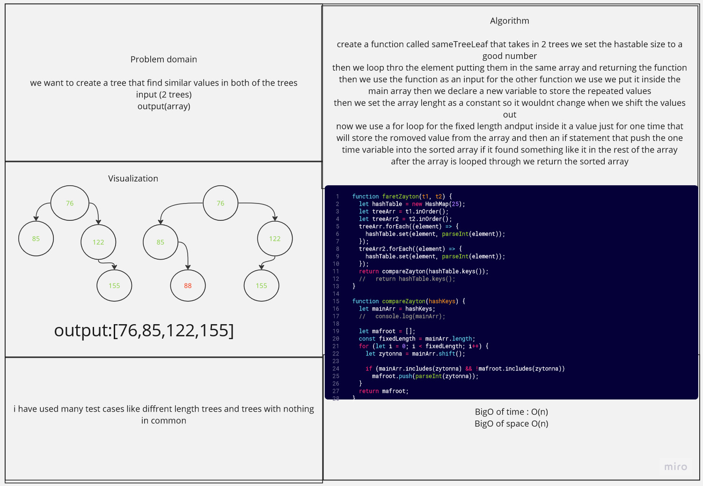

#  interconected trees using hash map
worked with hasan on this challange 
## Whiteboard Process

## Approach:
created this function to return the  mathceing values in a tree as a array of integers.
## Efficiency:

O(n) for space 
O(n) for time 

## Solutions 
work to return the value if it encountered it a second time 

***npm test treeInter.test.js***

